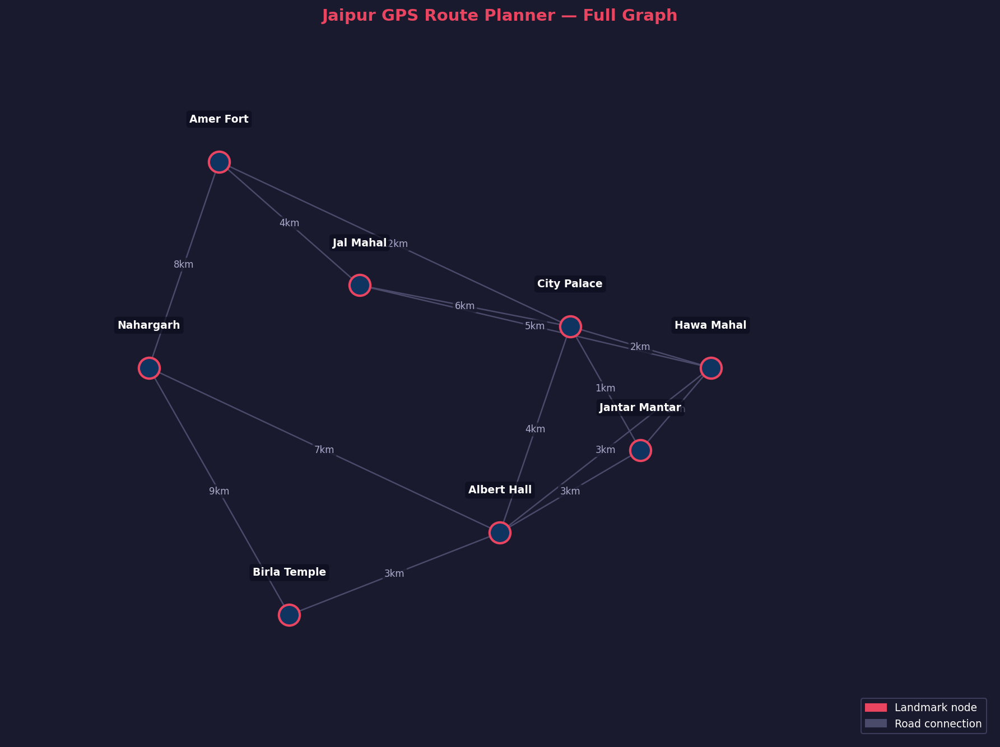
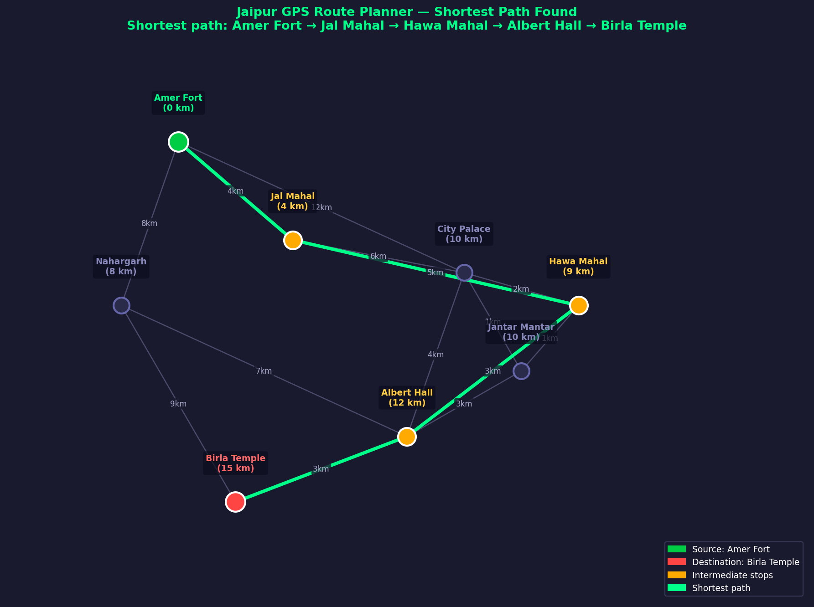
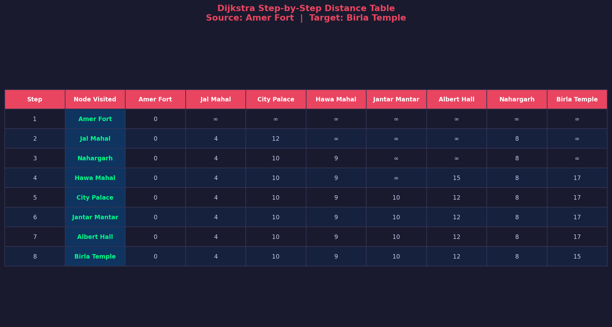
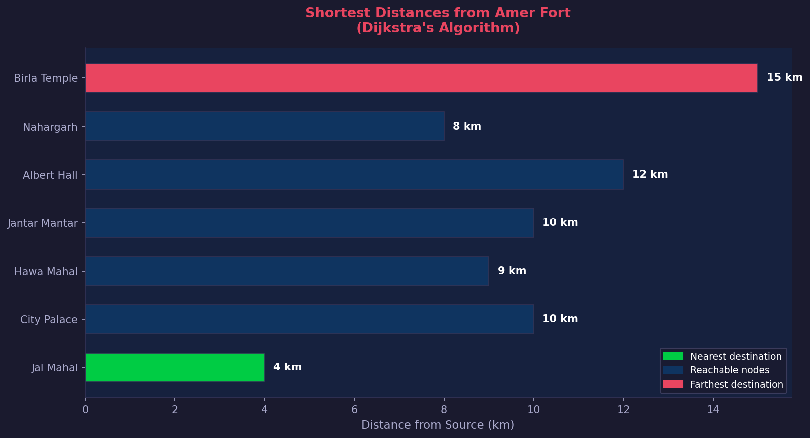

# Assignment 2 — Dijkstra's GPS Route Planner

**Course:** CSE2201 Design and Analysis of Algorithms  
**Algorithm:** Dijkstra's Shortest Path Algorithm  
**Application:** GPS Route Planner — Jaipur Landmarks  
**Language:** Python

---

## 1. Problem Statement

A GPS navigation system must find the shortest route between locations in real time. In Jaipur, tourist landmarks like Amer Fort, Hawa Mahal, City Palace, and Birla Temple are connected by roads of varying distances. A traveller starting from one landmark needs the shortest route to a destination.

**Problem Definition:** Given a weighted undirected graph where nodes represent Jaipur landmarks and edges represent roads with distances in km, find the shortest path from a source landmark to all other landmarks.

**Specific query demonstrated:** Shortest route from **Amer Fort** to **Birla Temple**.

### Graph Data

| From | To | Distance (km) |
|---|---|---|
| Amer Fort | Jal Mahal | 4 |
| Amer Fort | City Palace | 12 |
| Amer Fort | Nahargarh | 8 |
| Jal Mahal | City Palace | 6 |
| Jal Mahal | Hawa Mahal | 5 |
| City Palace | Hawa Mahal | 2 |
| City Palace | Jantar Mantar | 1 |
| City Palace | Albert Hall | 4 |
| Hawa Mahal | Albert Hall | 3 |
| Albert Hall | Nahargarh | 7 |
| Albert Hall | Birla Temple | 3 |
| Nahargarh | Birla Temple | 9 |

---

## 2. Algorithm Description and Pseudocode

**Dijkstra's Algorithm** is a greedy single-source shortest path algorithm proposed by Edsger W. Dijkstra in 1956. It computes minimum distances from a source to all other vertices in a weighted graph with non-negative edges.

**Core Idea:** Use a min-heap to always process the closest unvisited vertex. Relax neighbours — update their distance if a shorter path is found through the current vertex.

### Pseudocode

```
DIJKSTRA(Graph G, source s):

  for each vertex v in G:
      dist[v] = INFINITY
      prev[v] = NULL

  dist[s] = 0
  PQ = MIN-HEAP with all vertices, key = dist[]

  while PQ is not empty:
      u = EXTRACT-MIN(PQ)
      mark u as visited

      for each neighbour v of u:
          alt = dist[u] + weight(u, v)
          if alt < dist[v]:        ← relaxation
              dist[v] = alt
              prev[v] = u
              DECREASE-KEY(PQ, v, alt)

  return dist[], prev[]


RECONSTRUCT-PATH(prev[], source s, target t):
  path = []
  node = t
  while node ≠ NULL:
      path.prepend(node)
      node = prev[node]
  return path
```

### Key Concepts

| Concept | Explanation |
|---|---|
| Relaxation | Update dist[v] if dist[u] + w(u,v) < dist[v] |
| Min-Heap | Always processes closest unvisited vertex next |
| Greedy choice | Locally optimal → globally optimal path |
| Predecessor map | prev[] enables path reconstruction |
| Non-negative weights | Required for correctness |

---

## 3. Implementation

See [`code/dijkstra_gps.py`](code/dijkstra_gps.py) for full source.

### Core Algorithm

```python
import heapq

def dijkstra(graph, source):
    dist = {node: float('inf') for node in graph}
    prev = {node: None for node in graph}
    dist[source] = 0
    heap = [(0, source)]
    visited = set()

    while heap:
        d, u = heapq.heappop(heap)
        if u in visited:
            continue
        visited.add(u)

        for v, weight in graph[u]:
            if dist[u] + weight < dist[v]:
                dist[v] = dist[u] + weight
                prev[v] = u
                heapq.heappush(heap, (dist[v], v))

    return dist, prev


def reconstruct_path(prev, source, target):
    path = []
    node = target
    while node is not None:
        path.append(node)
        node = prev[node]
    path.reverse()
    return path if path[0] == source else []
```

---

## 4. Demonstration

### Console Output

```
Source      : Amer Fort
Destination : Birla Temple
Shortest distance : 15 km
Optimal route     : Amer Fort → Jal Mahal → Hawa Mahal → Albert Hall → Birla Temple

Step  Node Visited         Distance
  1   Amer Fort            0 km
  2   Jal Mahal            4 km
  3   Nahargarh            8 km
  4   Hawa Mahal           9 km
  5   City Palace          10 km
  6   Jantar Mantar        10 km
  7   Albert Hall          12 km
  8   Birla Temple         15 km  ← OPTIMAL
```

### Screenshots

| Fig | Description |
|---|---|
|  | Full Jaipur landmark graph |
|  | Shortest path highlighted (green) |
|  | Step-by-step distance table |
|  | Bar chart of all distances |

### All Shortest Distances from Amer Fort

| Destination | Distance | Path |
|---|---|---|
| Jal Mahal | 4 km | Amer Fort → Jal Mahal |
| Nahargarh | 8 km | Amer Fort → Nahargarh |
| Hawa Mahal | 9 km | → Jal Mahal → Hawa Mahal |
| City Palace | 10 km | → Jal Mahal → City Palace |
| Jantar Mantar | 10 km | → Jal Mahal → Hawa Mahal → Jantar Mantar |
| Albert Hall | 12 km | → Jal Mahal → Hawa Mahal → Albert Hall |
| **Birla Temple** | **15 km** | **→ Jal Mahal → Hawa Mahal → Albert Hall → Birla Temple** |

---

## 5. Complexity Analysis

### Time Complexity

| Operation | Times Called | Cost | Total |
|---|---|---|---|
| EXTRACT-MIN | V times | O(log V) | O(V log V) |
| Edge relaxation | E times | O(log V) | O(E log V) |
| **Total** | | | **O((V+E) log V)** |

For this graph: V=8, E=12 → O(20 × 3) = O(60) operations.

### Space Complexity: O(V+E)

### Comparison

| Algorithm | Time | Negative Weights | Use Case |
|---|---|---|---|
| Dijkstra | O((V+E) log V) | No | GPS, routing |
| Bellman-Ford | O(VE) | Yes | Currency arbitrage |
| Floyd-Warshall | O(V³) | Yes | All-pairs |
| BFS | O(V+E) | N/A | Unweighted graphs |

---

## 6. Conclusion

Thus, Dijkstra's algorithm was successfully implemented and applied to GPS route planning across 8 Jaipur landmarks. The algorithm correctly identified the shortest route from **Amer Fort to Birla Temple as 15 km** via Jal Mahal → Hawa Mahal → Albert Hall.

- Greedy min-heap guarantees global optimality for non-negative weighted graphs
- O((V+E) log V) scales efficiently to real city road networks
- 4 visualizations demonstrate correctness at every step
- Direct real-world relevance: Google Maps uses Dijkstra variants

**Limitations:** No negative weights; static graph (real GPS uses live traffic data).


